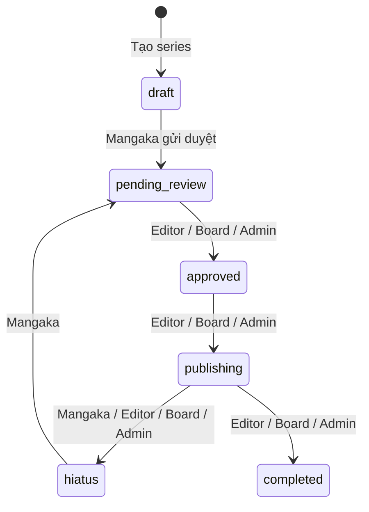

# BE — Supabase Auth + Profile API

**Controller → Service → Repository** — không gọi `DbContext` trực tiếp từ Controller/Service.

## Cấu hình

`appsettings.Development.json`: connection string, `Supabase:AnonKey`, `Supabase:JwtSecret`, `Google:*`.

Role lưu trong cột `profiles.role` (enum `user_role` trên Supabase).

## Chạy

```bash
cd BE
dotnet run
```

Swagger: https://localhost:7054/swagger

## I. AUTH — `/api/auth`

| Method | Endpoint | Mô tả |
|--------|----------|--------|
| POST | `/register` | Đăng ký |
| POST | `/login` | Đăng nhập |
| POST | `/refresh-token` | Refresh token |
| POST | `/logout` | Logout |
| GET | `/me` | Current user |
| PUT | `/profile` | Sửa profile của mình |

## II. PROFILE — `/api/profiles`

| Method | Endpoint | Role |
|--------|----------|------|
| GET | `/me` | đã login |
| PUT | `/update` | owner |
| GET | `/` | admin |
| GET | `/{id}` | all (đã login) |
| GET | `/assistants` | mangaka |
| GET | `/editors` | admin |
| PUT | `/{id}` | owner hoặc admin |
| DELETE | `/{id}` | admin (soft-delete `is_active=false`) |

## IIb. NOTIFICATIONS — `/api/notifications`

| Method | Endpoint | Mô tả |
|--------|----------|--------|
| GET | `/` | Danh sách (`?unreadOnly=true`) |
| PATCH | `/{id}/read` | Đánh dấu đã đọc |
| PATCH | `/read-all` | Đọc tất cả |

Phân quyền đọc `role` từ bảng `profiles` (không dựa JWT claim).

User mới đăng ký mặc định `role = assistant`. Đổi role admin: cập nhật DB hoặc `PUT` bởi admin (field `role`).

## III. SERIES — `/api/series`

| Method | Endpoint | Role / Ghi chú |
|--------|----------|----------------|
| GET | `/catalog?genre=&page=1&limit=10` | Public — truyện `approved`, `publishing`, `completed` |
| GET | `/` | Đã login — lọc theo role |
| GET | `/my-series` | mangaka |
| GET | `/ranking` | Đã login |
| GET | `/danger-zone` | mangaka / staff — rank ≥ 30 |
| GET | `/{id}` | Theo quyền xem |
| GET | `/{id}/stats` | Thống kê series |
| POST | `/{id}/cover` | Upload ảnh bìa (multipart) |
| POST | `/` | mangaka, admin |
| PUT | `/{id}` | author, editor gán, admin |
| PUT | `/{id}/status` | Luồng trạng thái (xem bên dưới) |
| DELETE | `/{id}` | admin; mangaka xóa bản nháp của mình |
| GET | `/{seriesId}/chapters` | Xem chapter theo quyền series |
| POST | `/{seriesId}/chapters` | mangaka (tác giả), admin |

## IV. TASKS & KANBAN

| Method | Endpoint | Role |
|--------|----------|------|
| GET | `/api/chapters/{chapterId}/kanban` | mangaka, assistant, staff |
| GET | `/api/tasks/my` | assistant |
| POST | `/api/pages/{pageId}/tasks` | mangaka, editor, admin |
| GET/PATCH/PUT/DELETE | `/api/tasks/{id}` | theo task |

## V. SUBMISSIONS

| Method | Endpoint | Role |
|--------|----------|------|
| GET | `/api/tasks/{taskId}/submissions` | assignee, mangaka, editor |
| POST | `/api/tasks/{taskId}/submissions` | assistant (multipart) |
| PATCH | `/api/submissions/{id}/review` | mangaka, editor, admin |
| GET | `/api/assistants/me/earnings` | assistant |

## VI. ANNOTATIONS

| Method | Endpoint | Role |
|--------|----------|------|
| GET/POST | `/api/pages/{pageId}/annotations` | studio |
| PUT/DELETE | `/api/annotations/{id}` | creator, admin |

## VII. BOARD & RANKINGS

| Method | Endpoint | Role |
|--------|----------|------|
| POST | `/api/board/votes` | board |
| GET | `/api/board/votes?seriesId=` | board, admin |
| GET | `/api/board/pending-series` | board, admin |
| GET | `/api/board/leaderboard?metric=votes\|popularity` | board, admin |
| POST | `/api/rankings` | board, admin |
| GET | `/api/rankings/history?seriesId=` | board, editor, mangaka (own) |

## VIII. PUBLISHING SCHEDULES

| Method | Endpoint | Role |
|--------|----------|------|
| GET/POST | `/api/series/{seriesId}/schedules` | xem: author/editor/board; tạo: board, editor, admin |
| PUT/DELETE | `/api/schedules/{id}` | board, editor, admin |

## IIIb. CHAPTERS — `/api/chapters`

| Method | Endpoint | Role |
|--------|----------|------|
| GET | `/{id}` | theo quyền series |
| PUT | `/{id}` | author / editor / admin |
| PUT | `/{id}/status` | luồng chapter status |

### Luồng trạng thái (status)



Xem `PRN232v1.http` để test.
