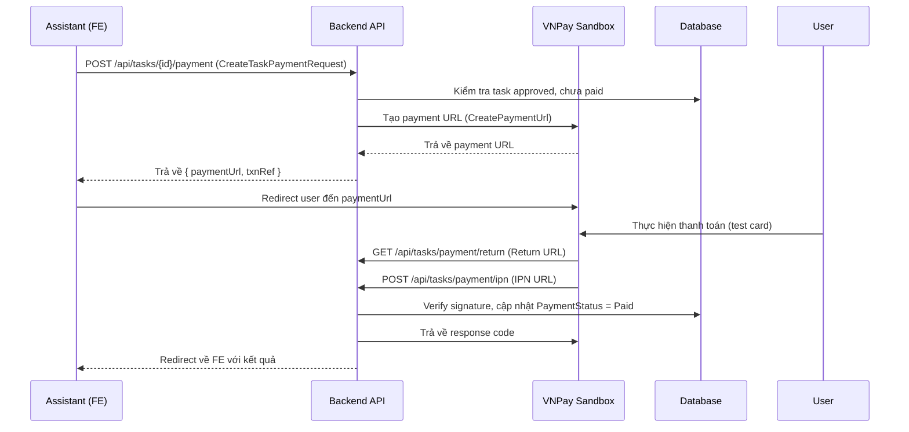

# PRN232v1 - Cấu Trúc Dự Án & Luồng Thanh Toán VNPay Sandbox

## 1. Tổng Quan Kiến Trúc

Dự án được tổ chức theo kiến trúc **Clean Architecture** với 3 lớp chính:

```
prn23/
├── BE/                 # Backend - ASP.NET Core Web API
├── BLL/                # Business Logic Layer
├── DAL/                # Data Access Layer
├── FE/                 # Frontend - React + Vite + TypeScript
└── scratch/            # Thư mục thử nghiệm/test
```

### 1.1 Backend (BE)
- **Framework**: ASP.NET Core 9.0
- **Database**: PostgreSQL (Supabase)
- **ORM**: Entity Framework Core
- **Authentication**: JWT Bearer (Supabase Auth)
- **Storage**: Supabase Storage + Cloudinary

### 1.2 Business Logic Layer (BLL)
- **Services**: Xử lý nghiệp vụ, workflow, notification
- **Configuration**: Options pattern cho các external services
- **DTOs**: Data Transfer Objects
- **Middleware**: Exception handling, validation

### 1.3 Data Access Layer (DAL)
- **Models**: Entity classes mapping với database
- **Repositories**: Generic repository pattern + UnitOfWork
- **Migrations**: EF Core migrations
- **Common**: Enum/constant định nghĩa trạng thái

### 1.4 Frontend (FE)
- **Framework**: React 18 + TypeScript
- **Build Tool**: Vite
- **Routing**: React Router v6
- **UI Library**: shadcn/ui + Tailwind CSS
- **State Management**: React Query + Context API

---

## 2. Cấu Trúc Thư Mục Chi Tiết

### BE/ (Backend API)
```
BE/
├── Controllers/           # API Controllers
│   ├── AuthController.cs
│   ├── TasksController.cs
│   ├── SeriesController.cs
│   ├── PagesController.cs
│   ├── SubmissionsController.cs
│   ├── ChaptersController.cs
│   ├── ProfilesController.cs
│   ├── NotificationsController.cs
│   ├── RankingsController.cs
│   └── BoardsController.cs
├── Program.cs             # Entry point, DI configuration
├── appsettings.json       # Cấu hình production
├── appsettings.example.json # Template cấu hình
└── PRN232v1.csproj
```

### BLL/ (Business Logic)
```
BLL/
├── Configuration/         # Options classes
│   ├── SupabaseOptions.cs
│   ├── GoogleAuthOptions.cs
│   ├── CloudinaryOptions.cs
│   └── VnPayOptions.cs          # ← VNPay config
├── Dtos/                  # Data Transfer Objects
│   ├── Tasks/
│   │   └── TaskDtos.cs
│   ├── Series/
│   ├── Pages/
│   └── ...
├── Services/              # Business services
│   ├── Tasks/
│   │   ├── TaskService.cs       # ← Xử lý task + payment
│   │   └── VnPayService.cs      # ← VNPay integration
│   ├── Auth/
│   ├── Series/
│   ├── Pages/
│   ├── Submissions/
│   ├── Notifications/
│   ├── Workflow/
│   └── ...
├── Extensions/
│   └── ServiceCollectionExtensions.cs  # DI registration
├── Middleware/
└── BLL.csproj
```

### DAL/ (Data Access)
```
DAL/
├── Models/                # Entity classes
│   ├── EditorTask.cs      # ← Task entity có VNPay fields
│   ├── Page.cs
│   ├── Chapter.cs
│   ├── Series.cs
│   ├── Profile.cs
│   ├── Submission.cs
│   ├── MangakaAssistant.cs
│   └── ...
├── Repositories/
│   ├── Repository.cs
│   └── UnitOfWork.cs
├── Data/
│   └── AppDbContext.cs
├── Migrations/
├── Common/
│   ├── TaskStatuses.cs
│   ├── PaymentStatuses.cs  # ← Trạng thái thanh toán
│   ├── TaskTypes.cs
│   └── PageStatus.cs
└── DAL.csproj
```

### FE/ (Frontend)
```
FE/
├── src/
│   ├── components/        # Reusable UI components
│   │   ├── ui/           # shadcn/ui components
│   │   └── ...
│   ├── pages/            # Page components
│   │   ├── mangaka/      # Mangaka dashboard pages
│   │   ├── assistant/    # Assistant pages
│   │   ├── editor/       # Editor pages
│   │   ├── auth/         # Login/Register
│   │   └── ...
│   ├── hooks/            # Custom React hooks
│   │   ├── useTasks.ts
│   │   ├── useAuth.ts
│   │   └── ...
│   ├── services/         # API service layer
│   │   ├── api.ts
│   │   ├── tasks.ts      # ← Task API calls
│   │   └── ...
│   ├── types/            # TypeScript types
│   │   └── domain.ts
│   ├── contexts/         # React Context providers
│   ├── utils/            # Utility functions
│   ├── main.tsx
│   └── App.tsx
├── package.json
├── vite.config.ts
└── tsconfig.json
```

---

## 3. Luồng Thanh Toán VNPay Sandbox

### 3.1 Tổng Quan Luồng



### 3.2 Cấu Hình VNPay (appsettings.json)

```json
"VnPay": {
  "TmnCode": "YOUR_TMN_CODE",           // Terminal Code từ VNPay
  "HashSecret": "YOUR_HASH_SECRET",     // Secure Hash Secret
  "BaseUrl": "https://sandbox.vnpayment.vn/paymentv2/vpcpay.html",
  "ReturnUrl": "http://localhost:5173/api/tasks/payment/return",       // Endpoint backend xử lý kết quả
  "IpnUrl": "http://localhost:5173/api/tasks/payment/ipn",             // Endpoint backend xử lý IPN
  "FrontendPaymentReturnBaseUrl": "http://localhost:5173/tasks/payment/return" // URL frontend để redirect
}
```

### 3.3 Các Endpoint API

#### 3.3.1 Tạo Payment URL
```
POST /api/tasks/{taskId}/payment
Authorization: Bearer <token>
Content-Type: application/json

{
  "returnUrl": "http://localhost:5173/tasks/payment/return" // Lưu ý: returnUrl này chỉ là placeholder từ FE, BE sẽ dùng cấu hình của nó
}
```

**Response:**
```json
{
  "taskId": "guid",
  "paymentUrl": "https://sandbox.vnpayment.vn/...",
  "txnRef": "TASK_{taskId}_{timestamp}",
  "paymentStatus": "unpaid"
}
```

#### 3.3.2 Return URL (User redirect sau thanh toán)
Sau khi VNPay xử lý thanh toán, user sẽ được redirect về endpoint backend:
```
GET /api/tasks/payment/return?vnp_Amount=...&vnp_ResponseCode=00&vnp_TxnRef=...
```
Backend sẽ xử lý kết quả và **redirect** user đến `FrontendPaymentReturnBaseUrl` với các query parameter tương ứng:
```
HTTP 302 Redirect to:
http://localhost:5173/tasks/payment/return?taskId=...&success=true&message=...&responseCode=...&txnRef=...
```

#### 3.3.3 IPN URL (Server-to-server notification)
```
POST /api/tasks/payment/ipn
Content-Type: application/x-www-form-urlencoded

vnp_Amount=...&vnp_ResponseCode=00&vnp_TxnRef=...
```

### 3.4 Model Dữ Liệu Liên Quan

#### EditorTask (DAL/Models/EditorTask.cs)
```csharp
public partial class EditorTask
{
    // ... existing fields
    
    public decimal Price { get; set; }
    public string PaymentStatus { get; set; } = PaymentStatuses.Unpaid; // unpaid, paid, failed, refunded
    public DateTime? PaidAt { get; set; }
    
    // VNPay tracking fields
    public string? VnPayTxnRef { get; set; }        // Mã giao dịch của hệ thống
    public string? VnPayTransactionNo { get; set; } // Mã giao dịch VNPay
    public string? VnPayBankCode { get; set; }      // Mã ngân hàng
    public string? VnPayResponseCode { get; set; }  // Mã phản hồi VNPay
}
```

#### PaymentStatuses (DAL/Common/PaymentStatuses.cs)
```csharp
public static class PaymentStatuses
{
    public const string Unpaid = "unpaid";
    public const string Paid = "paid";
    public const string Failed = "failed";
    public const string Refunded = "refunded";
    public static readonly IReadOnlyList<string> All = [Unpaid, Paid, Failed, Refunded];
    public static bool IsValid(string status) => All.Contains(status);
}
```

### 3.5 VNPay Service (BLL/Services/Tasks/VnPayService.cs)

Chức năng chính:
- **CreatePaymentUrl()**: Tạo URL thanh toán với signature HMAC SHA512
- **VerifyCallback()**: Xác thực chữ ký từ VNPay callback
- **GetResponseCode()**: Lấy mã phản hồi từ callback
- **GetTxnRef()**: Lấy mã giao dịch từ callback
- **GetTransactionNo()**: Lấy mã giao dịch VNPay từ callback

### 3.6 Task Service - Payment Logic (BLL/Services/Tasks/TaskService.cs)

#### CreateTaskPaymentAsync()
- Kiểm tra quyền: Chỉ assistant được giao task hoặc admin/mangaka
- Kiểm tra trạng thái: Task phải `Approved` và `PaymentStatus != Paid`
- Tạo `txnRef` unique: `TASK_{taskId:N}_{timestamp}`
- Gọi `VnPayService.CreatePaymentUrl()`
- Lưu `VnPayTxnRef` vào task
- Trả về payment URL

#### ProcessPaymentCallbackAsync()
- Xác thực chữ ký HMAC SHA512
- Parse `txnRef` để lấy `taskId`
- Cập nhật `PaymentStatus = Paid` nếu `responseCode == "00"`
- Lưu thêm: `VnPayTransactionNo`, `VnPayBankCode`, `VnPayResponseCode`, `PaidAt`
- Trả về kết quả cho frontend

### 3.7 Frontend Integration
 
#### API Service (FE/src/services/paymentApi.ts)
```typescript
export async function createTaskPayment(taskId: string, returnUrl: string) {
  const res = await api.post<CreateTaskPaymentResponse>(`/tasks/${taskId}/payment`, { returnUrl });
  return res.data;
}
```

#### Payment Return Page (FE/src/pages/common/PaymentReturnPage.tsx)
- Route: `/payment-return`
- Xử lý callback từ VNPay qua backend
- Hiển thị trạng thái: loading/success/failed/pending
- Hiển thị chi tiết giao dịch (mã VNPay, số tiền, ngân hàng, thời gian, response code)
- Cung cấp nút quay lại danh sách task

#### Payment Flow Component (FE/src/components/workspace/TaskList.tsx)
1. User click "Thanh toán" trên task đã approved
2. Gọi `createTaskPayment()` lấy `paymentUrl`
3. `window.location.href = paymentUrl` redirect đến VNPay
4. User thanh toán bằng thẻ test VNPay
5. VNPay redirect về backend ReturnUrl
6. Backend verify và redirect về FE `/payment-return` với query params
7. FE parse kết quả, hiển thị thông báo thành công/thất bại
8. Cập nhật UI: Task payment status = "paid"

### 3.8 Test Card VNPay Sandbox

| Loại thẻ | Số thẻ | Ngày hết hạn | OTP |
|----------|--------|--------------|-----|
| Thành công | 9704198526191432 | 07/15 | 123456 |
| Thất bại (hết hạn) | 9704198526191432 | 07/15 | 123456 |
| Thất bại (sai OTP) | 9704198526191432 | 07/15 | 111111 |

**Lưu ý**: Sandbox không trừ tiền thật, chỉ mô phỏng luồng thanh toán.

---

## 4. Điểm Tích Hợp Quan Trọng

### 4.1 Dependency Injection (BLL/Extensions/ServiceCollectionExtensions.cs)
```csharp
public static IServiceCollection AddAppAuthentication(this IServiceCollection services, IConfiguration configuration)
{
    services.Configure<SupabaseOptions>(configuration.GetSection(SupabaseOptions.SectionName));
    services.Configure<GoogleAuthOptions>(configuration.GetSection(GoogleAuthOptions.SectionName));
    services.Configure<CloudinaryOptions>(configuration.GetSection(CloudinaryOptions.SectionName));
    services.Configure<VnPayOptions>(configuration.GetSection(VnPayOptions.SectionName)); // ← VNPay config
    // ...
}
```

### 4.2 Controller Endpoints (BE/Controllers/TasksController.cs)
```csharp
[HttpPost("{taskId:guid}/payment")]
public async Task<ActionResult<CreateTaskPaymentResponse>> CreateTaskPayment(
    Guid taskId, 
    CreateTaskPaymentRequest request,
    CancellationToken ct)

[HttpGet("payment/return")]
public async Task<IActionResult> PaymentReturn(CancellationToken ct)

[HttpPost("payment/ipn")]
public async Task<IActionResult> PaymentIpn(CancellationToken ct)
```

---

## 5. Checklist Triển Khai

- [x] Cấu hình `VnPayOptions` trong appsettings.json/.example.json
- [x] Đăng ký `VnPayOptions` trong DI container
- [x] Cập nhật `EditorTask` entity với các field VNPay tracking
- [x] Tạo `VnPayService` với logic tạo URL & verify callback
- [x] Cập nhật `TaskService` với `CreateTaskPaymentAsync` & `ProcessPaymentCallbackAsync`
- [x] Thêm endpoints trong `TasksController`
- [x] Build backend thành công
- [x] Build frontend thành công
- [ ] Test end-to-end với VNPay sandbox
- [ ] Cập nhật FE payment UI components

---

## 6. Lưu Ý Bảo Mật

1. **HashSecret**: Không commit vào git, dùng environment variable
2. **IPN URL**: Phải accessible từ internet (ngrok cho local dev)
3. **Verify Signature**: Luôn verify callback trước khi cập nhật DB
4. **Idempotency**: Xử lý duplicate IPN call (check PaymentStatus trước khi update)
5. **Logging**: Log đầy đủ txnRef, responseCode cho audit trail

---

## 7. Tài Liệu Tham Khảo

- [VNPay API Documentation](https://sandbox.vnpayment.vn/apis/)
- [VNPay Sandbox Test Guide](https://sandbox.vnpayment.vn/merchantv2/help)
- [HMAC SHA512 Implementation](https://docs.microsoft.com/en-us/dotnet/api/system.security.cryptography.hmacsha512)