# Sơ đồ luồng hoạt động chi tiết — MangaFlow

Tài liệu bổ sung cho [ROLE-WORKFLOWS.md](./ROLE-WORKFLOWS.md), mô tả **từng bước** bằng sơ đồ Mermaid.

> Mở file này trong VS Code / GitHub / Cursor để xem diagram render.  
> Công cụ hỗ trợ: [Mermaid Live Editor](https://mermaid.live)

---

## Mục lục

1. [Vòng đời Series (state machine)](#1-vòng-đời-series-state-machine)
2. [Luồng tổng thể đa role (sequence)](#2-luồng-tổng-thể-đa-role-sequence)
3. [Mangaka](#3-mangaka)
4. [Assistant](#4-assistant)
5. [Editor](#5-editor)
6. [Board](#6-board)
7. [Admin](#7-admin)
8. [Luồng Task + Submission](#8-luồng-task--submission)
9. [Luồng thanh toán (Admin payroll)](#9-luồng-thanh-toán-admin-payroll)
10. [Luồng mời Assistant / Editor](#10-luồng-mời-assistant--editor)
11. [Luồng Auth & chung](#11-luồng-auth--chung)
12. [Sơ đồ phụ thuộc quyền (ai làm được gì)](#12-sơ-đồ-phụ-thuộc-quyền-ai-làm-được-gì)

---

## 1. Vòng đời Series (state machine)

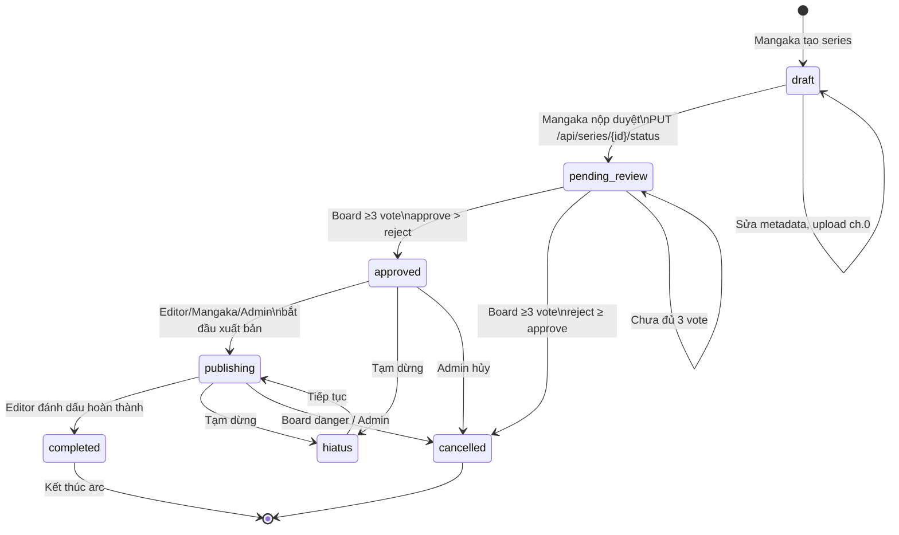

### Ràng buộc theo trạng thái

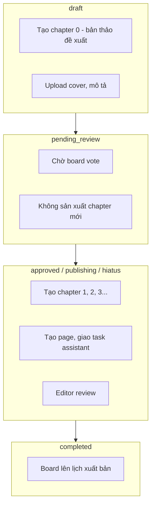

---

## 2. Luồng tổng thể đa role (sequence)

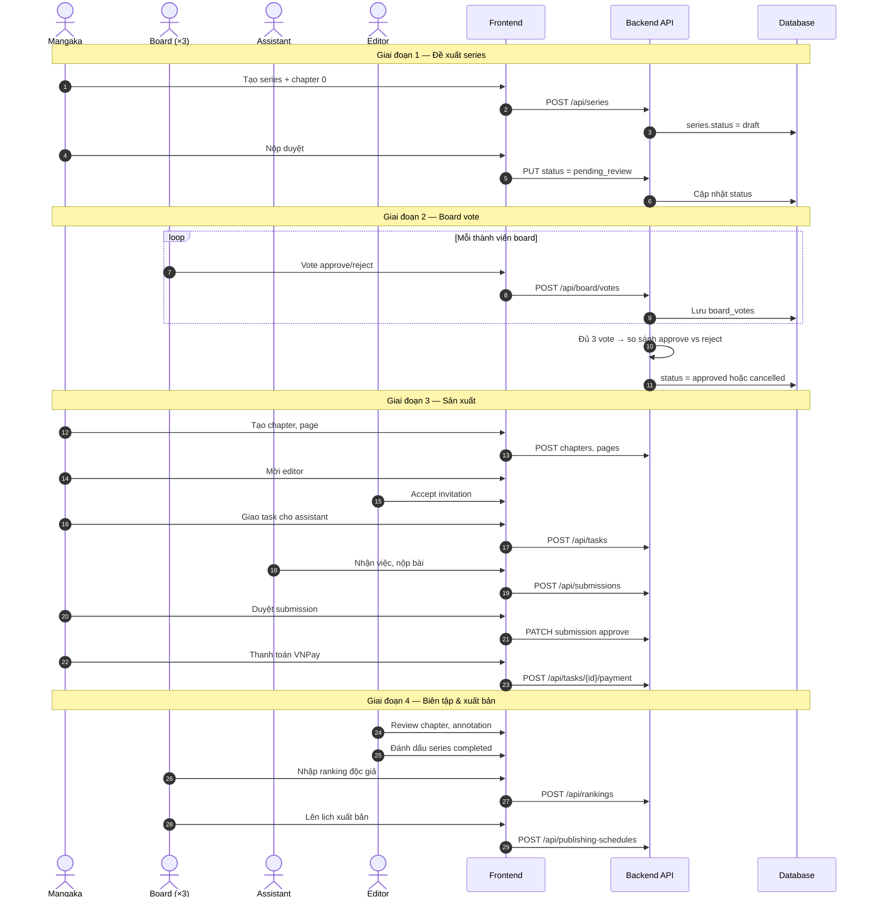

---

## 3. Mangaka

### 3.1 Onboarding & nộp duyệt series

```mermaid
flowchart TD
    START([Đăng nhập mangaka]) --> DASH[/mangaka/dashboard/]
    DASH --> CREATE[/mangaka/series/create/]
    CREATE --> API1[POST /api/series]
    API1 --> DRAFT[(status: draft)]

    DRAFT --> CH0[Tạo chapter 0\nbản thảo đề xuất]
    CH0 --> COVER[Upload cover\nPOST /api/series/{id}/cover]
    COVER --> INVITE{A muốn mời\neditor sớm?}
    INVITE -->|Sau approved| SUBMIT
    INVITE -->|Không| SUBMIT

    SUBMIT[/mangaka/submissions/\nNộp duyệt] --> API2[PUT /api/series/{id}/status\npending_review]
    API2 --> WAIT[Chờ board ≥3 vote]
    WAIT -->|approved| PROD[Bắt đầu sản xuất]
    WAIT -->|cancelled| REJECT[Series bị từ chối]
```

### 3.2 Sản xuất chapter & page

```mermaid
flowchart TD
    PROD([Series approved+]) --> CHLIST[/mangaka/chapters/]
    CHLIST --> NEWCH[Tạo chapter mới\nPOST /api/series/{id}/chapters]
    NEWCH --> CHDET[/mangaka/chapters/{id}/]
    CHDET --> NEWPAGE[Tạo page\nPOST /api/pages]
    NEWPAGE --> WS[/mangaka/pages/{id}/workspace/]

    WS --> TASK{Tạo task\ncho assistant?}
    TASK -->|Có| CREATETASK[POST /api/tasks\ngán assistant + giá]
    TASK -->|Không| EDIT[Tự chỉnh page]
    CREATETASK --> KANBAN[Kanban task theo chapter\nGET /api/chapters/{id}/kanban]
    EDIT --> PUBPAGE[Cập nhật page status]
```

### 3.3 Quản lý team (Assistant & Editor)

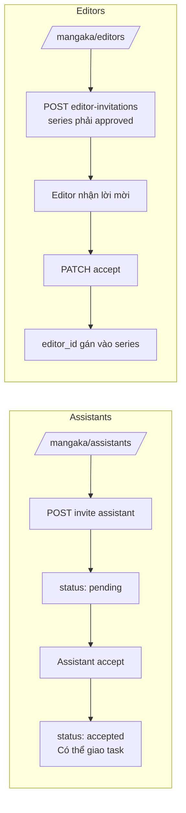

### 3.4 Review task & thanh toán

```mermaid
flowchart TD
    NOTIFY[Thông báo: assistant nộp bài] --> REVIEW[/mangaka/tasks/{id}/review/]
    REVIEW --> DECIDE{Duyệt?}
    DECIDE -->|Approve| APP[task.status = approved]
    DECIDE -->|Reject| REJ[task.status = rejected\nAssistant sửa lại]
    APP --> PAY{Thanh toán?}
    PAY -->|Có| VNPAY[POST /api/tasks/{id}/payment]
    VNPAY --> PAID[payment_status = paid]
    REJ --> REV2[Assistant nộp version mới]
    REV2 --> REVIEW
```

---

## 4. Assistant

### 4.1 Luồng tổng Assistant

```mermaid
flowchart TD
    LOGIN([Đăng nhập assistant]) --> DASH[/assistant/dashboard/]
    DASH --> INV_CHECK{Có lời mời\nstudio?}
    INV_CHECK -->|Có| INV[/assistant/invitations/]
    INV --> RESPOND[Accept / Reject\nmangaka_assistants]
    INV_CHECK -->|Không| TASKS
    RESPOND --> TASKS[/assistant/tasks/]

    TASKS --> PICK[Chọn task được giao]
    PICK --> START[PATCH status in_progress]
    START --> WORK[Làm việc trên page region]
    WORK --> SUBMIT[/assistant/tasks/{id}/submit/]
    SUBMIT --> API[POST /api/submissions]

    API --> WAIT[Chờ mangaka review]
    WAIT -->|approved| APPROVED[/assistant/approved/]
    WAIT -->|rejected| REV[/assistant/revisions/]
    REV --> WORK

    APPROVED --> INCOME[/assistant/income/\nGET earnings]
    TASKS --> CAL[/assistant/calendar/\nDeadline]
```

### 4.2 Trạng thái task từ góc nhìn Assistant

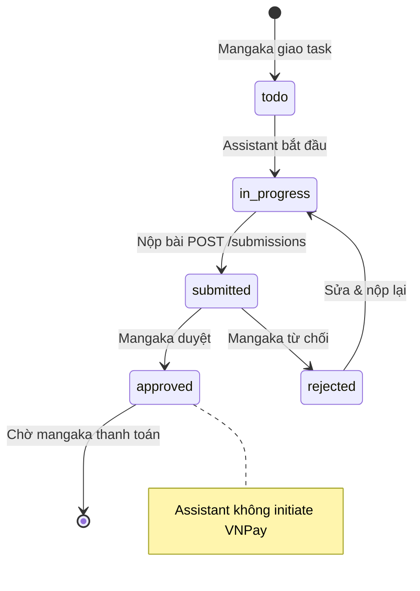

---

## 5. Editor

### 5.1 Luồng tổng Editor

```mermaid
flowchart TD
    LOGIN([Đăng nhập editor]) --> DASH[/editor/dashboard/]
    DASH --> INV[/editor/invitations/]
    INV --> ACC{Chấp nhận\nseries?}
    ACC -->|Có| SERIES[/editor/series/]
    ACC -->|Không| DASH

    SERIES --> META[Sửa metadata series\nPUT /api/series/{id}]
    SERIES --> REVLIST[/editor/reviews/]
    REVLIST --> CHREV[/editor/chapters/{id}/review/]
    CHREV --> ANNO[POST /api/annotations\ncorrection, dialogue, warning]
    ANNO --> CHSTATUS[PUT chapter status]

    SERIES --> COMPLETE[Đánh dấu series completed\nPUT status = completed]
    COMPLETE --> BOARD_SCHEDULE[Board có thể lên lịch xuất bản]

    DASH --> RANK[/editor/ranking-watch/]
    RANK --> DANGER[/editor/series-defense/\nGET danger-zone series]
```

### 5.2 Review chapter chi tiết

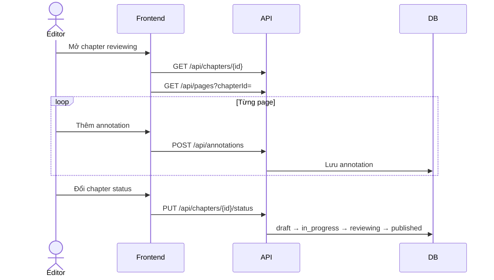

---

## 6. Board

### 6.1 Vote duyệt series (chi tiết)

```mermaid
flowchart TD
    START([Series pending_review]) --> LIST[/board/submissions/]
    LIST --> DETAIL[/board/submissions/{id}/]
    DETAIL --> VOTE[POST /api/board/votes\napprove | reject + comment]

    VOTE --> COUNT{Đếm vote\ntừ board member}
    COUNT -->|< 3 vote| WAIT[Vẫn pending_review\nHiển thị x/y phiếu]
    WAIT --> VOTE

    COUNT -->|≥ 3 vote| COMPARE{approve > reject?}
    COMPARE -->|Có| APPROVED[(status: approved)]
    COMPARE -->|Không| CANCEL[(status: cancelled)]

    APPROVED --> APP_LIST[/board/approved-series/]
    CANCEL --> REJ_LIST[Dashboard / submissions]
```

### 6.2 Quorum logic

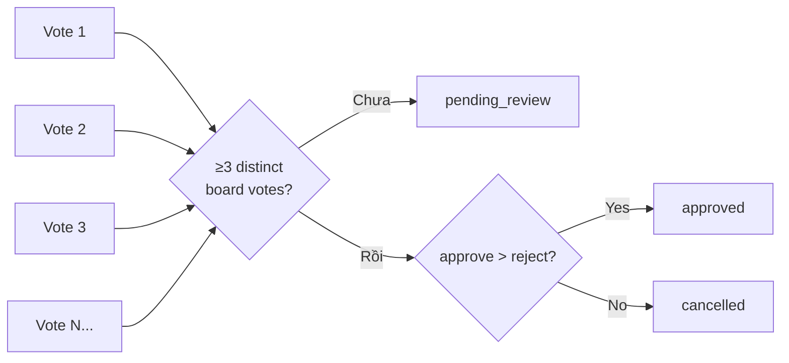

### 6.3 Ranking & lịch xuất bản

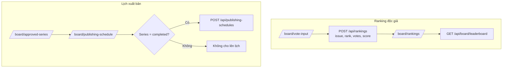

### 6.4 Danger zone decision

```mermaid
flowchart TD
    PUB[(Series publishing)] --> RANK[Ranking thấp\nrank ≥ 30]
    RANK --> DZ[GET /api/series/danger-zone]
    DZ --> SD[/board/series-decisions/]
    SD --> DET[/board/series-decisions/{id}/]
    DET --> DEC{Quyết định}

    DEC -->|continue| CONT[Giữ publishing]
    DEC -->|monthly| MON[Đổi frequency monthly]
    DEC -->|hiatus| HI[status = hiatus]
    DEC -->|cancel| CAN[status = cancelled]

    CONT --> API[POST /api/board/danger-series/{id}/decision]
    MON --> API
    HI --> API
    CAN --> API
```

### 6.5 Báo cáo

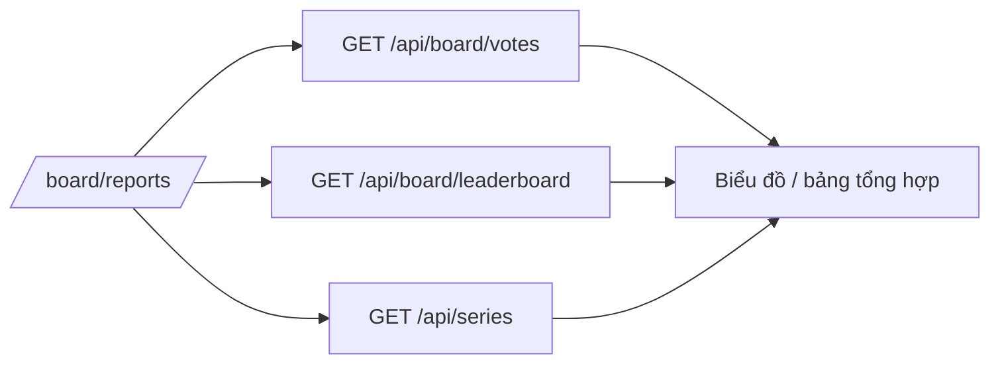

---

## 7. Admin

```mermaid
flowchart TD
    LOGIN([Đăng nhập admin]) --> DASH[/admin/dashboard/]
    DASH --> STATS[Thống kê user, series, role]

    DASH --> USERS[/admin/users/]
    USERS --> CREATE[/admin/users/create/]
    USERS --> DETAIL[/admin/users/{id}/]
    DETAIL --> EDIT[/admin/users/{id}/edit/]

    CREATE & EDIT --> API_P[GET/PUT/DELETE /api/profiles]
    API_P --> ROLE[Đổi role, is_active]

    DASH --> ROLES[/admin/roles/]
    DASH --> ACT[/admin/activity/]
    ACT --> LOG[GET /api/activity-logs\nfilter, stats]

    DASH --> SET[/admin/settings/]

    subgraph Override quyền
        ADMIN_ANY[Admin có thể:\n- Đổi mọi series status\n- Xem mọi data\n- Xóa series/chapter]
    end
```

---

## 8. Luồng Task + Submission

### 8.1 State machine đầy đủ

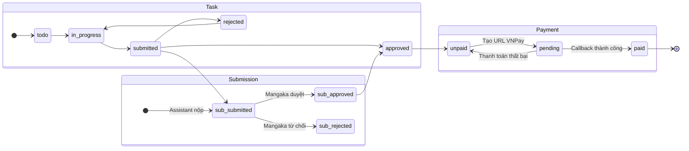

### 8.2 Sequence: từ giao task đến trả tiền

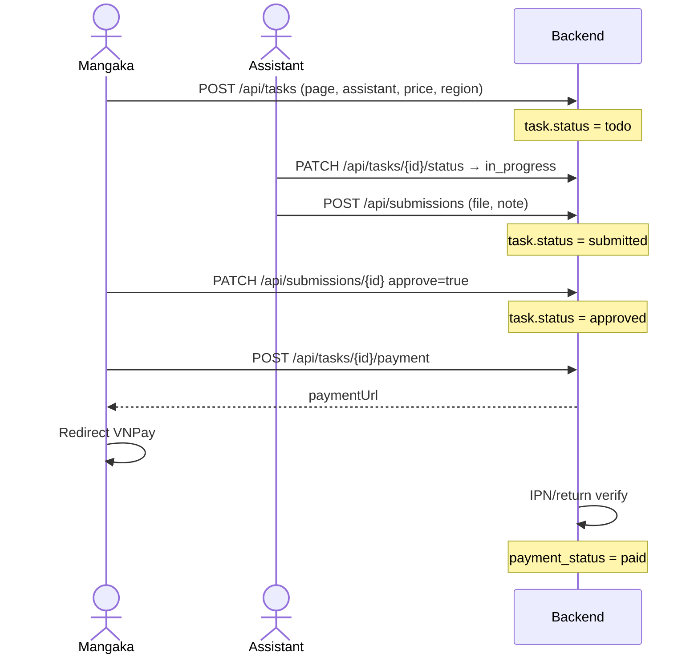

### 8.3 Loại task (task_type)

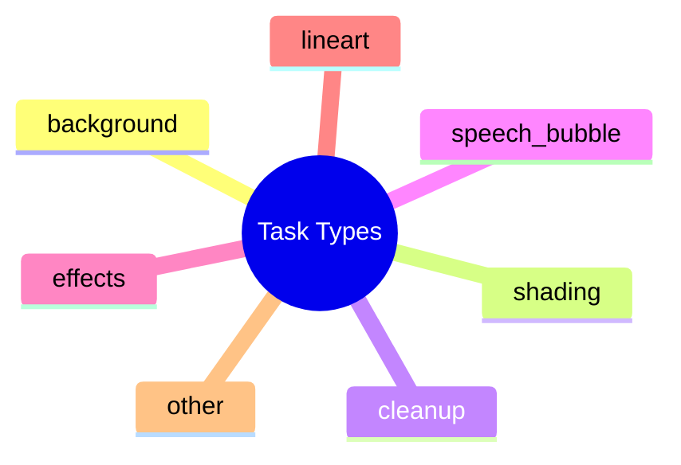

---

## 9. Luồng thanh toán (Admin payroll)

> VNPay từng-task trên FE đã gỡ. Chi trả qua `/admin/payroll` (ngày 5). Chi tiết: [ROLE-WORKFLOWS.md](./ROLE-WORKFLOWS.md#luồng-thanh-toán-admin-payroll).

```mermaid
sequenceDiagram
    participant M as Mangaka
    participant A as Assistant
    participant AD as Admin
    participant BE as Backend

    M->>BE: Duyệt task (approved)
    Note over BE: Task vào kỳ payroll tháng
    AD->>BE: GET payroll summaries
    AD->>BE: Mark paid
    BE-->>A: payment_status = paid
```

---

## 10. Luồng mời Assistant / Editor

### 10.1 Mời Assistant (studio)

```mermaid
sequenceDiagram
    actor M as Mangaka
    actor A as Assistant
    participant BE as API

    M->>BE: POST /api/profiles/assistants/invite
    Note over BE: mangaka_assistants.status = pending
    A->>BE: GET invitations
    A->>BE: PATCH respond accept/reject
    alt accepted
        Note over BE: status = accepted
        M->>BE: POST /api/tasks assigned_to = assistant
    else rejected
        Note over BE: status = rejected
    end
```

### 10.2 Mời Editor (series)

```mermaid
sequenceDiagram
    actor M as Mangaka
    actor E as Editor
    participant BE as API

    Note over M: Series phải approved
    M->>BE: POST /api/series/{id}/editor-invitations
    Note over BE: invitation.status = pending
    E->>BE: GET /api/series/editor-invitations/mine
    E->>BE: PATCH .../accept hoặc reject
    alt accepted
        BE->>BE: series.editor_id = editor
    end
```

---

## 11. Luồng Auth & chung

### 11.1 Đăng nhập / đăng ký

```mermaid
flowchart TD
    GUEST([Khách]) --> LAND[/ Landing /]
    LAND --> LOGIN[/login/]
    LAND --> REG[/register/]

    LOGIN --> EMAIL[POST /api/auth/login]
    REG --> REGAPI[POST /api/auth/register]

    LOGIN --> GOOGLE[Google OAuth]
    GOOGLE --> CB[/auth/google/callback/]
    CB --> TOKEN[Lưu JWT + user localStorage]

    TOKEN --> ROUTE{role?}
    ROUTE -->|mangaka| MD[/mangaka/dashboard/]
    ROUTE -->|assistant| AD[/assistant/dashboard/]
    ROUTE -->|editor| ED[/editor/dashboard/]
    ROUTE -->|board| BD[/board/dashboard/]
    ROUTE -->|admin| ADM[/admin/dashboard/]
```

### 11.2 Tính năng chung mọi role

```mermaid
flowchart LR
    subgraph Common
        N[/notifications/\nGET /api/notifications]
        P[/profile/\nGET/PUT profiles/me]
        S[/settings/]
        LOGOUT[POST /api/auth/logout]
    end

    N --> READ[Đánh dấu đã đọc]
    P --> AVATAR[Cập nhật avatar, bio]
```

---

## 12. Sơ đồ phụ thuộc quyền (ai làm được gì)

```mermaid
flowchart TB
    subgraph Series status change
        M1[Mangaka author] -->|draft, pending_review, hiatus| SS1[PUT series/status]
        E1[Editor assigned] -->|publishing, completed, hiatus| SS1
        B1[Board] -->|vote only pending| VOTE[POST board/votes]
        A1[Admin] -->|any status| SS1
    end

    subgraph Task
        M2[Mangaka/Editor] -->|create, review, pay| T1[Tasks API]
        AS2[Assistant] -->|in_progress, submit| T1
        AD2[Admin] -->|all| T1
    end

    subgraph Publishing schedule
        B2[Board] -->|series completed| PS1[POST publishing-schedules]
        AD3[Admin] -->|all| PS1
    end
```

### Ma trận tóm tắt

| Hành động | Mangaka | Assistant | Editor | Board | Admin |
|-----------|:-------:|:---------:|:------:|:-----:|:-----:|
| Tạo series | ✓ | | | | ✓ |
| Nộp duyệt series | ✓ | | | | ✓ |
| Vote duyệt series | | | | ✓ | |
| Sản xuất chapter | ✓* | | | | ✓ |
| Giao task | ✓ | | ✓** | | ✓ |
| Làm & nộp task | | ✓ | | | |
| Review submission | ✓ | | ✓** | | ✓ |
| Thanh toán VNPay | ✓ | | ✓** | | ✓ |
| Review chapter | | | ✓ | | ✓ |
| Nhập ranking | | | | ✓ | ✓ |
| Lịch xuất bản | | | | ✓ | ✓ |
| Danger decision | | | | ✓ | |
| Quản lý user | | | | | ✓ |

\* Sau khi series `approved`  
\*\* Editor chỉ trên series được gán

---

## Liên kết tài liệu

| File | Nội dung |
|------|----------|
| [ROLE-WORKFLOWS.md](./ROLE-WORKFLOWS.md) | Mô tả văn bản, bảng API, menu |
| [FE-BE-INTEGRATION-PLAN.md](./FE-BE-INTEGRATION-PLAN.md) | Kế hoạch tích hợp FE–BE |
| `scripts/supabase-seed-sample-data.sql` | Dữ liệu demo |

---

*Sơ đồ đồng bộ với quorum board = 3 phiếu (`BoardService.MinimumBoardVotesForDecision`).*
