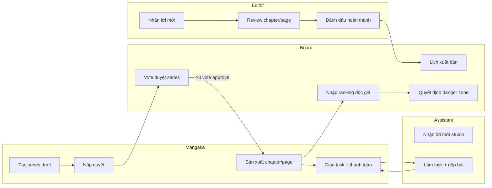
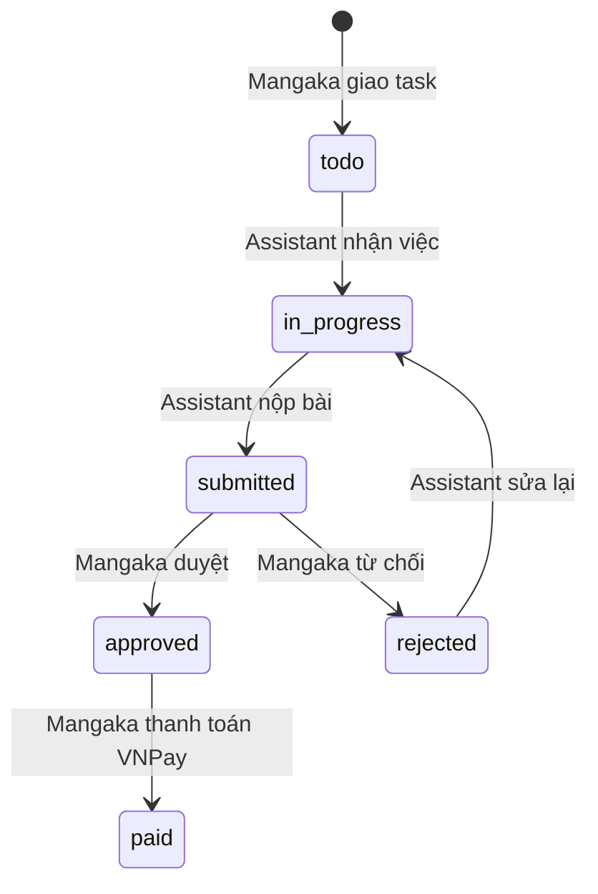

# Luồng chính theo từng role — MangaFlow

Tài liệu mô tả các luồng nghiệp vụ chính của web **MangaFlow / InkFlow** theo từng role.

> **Sơ đồ chi tiết (Mermaid):** xem [ROLE-WORKFLOWS-DIAGRAMS.md](./ROLE-WORKFLOWS-DIAGRAMS.md)

Hệ thống có **5 role**: `mangaka`, `assistant`, `editor`, `board`, `admin`. Mỗi role có dashboard và menu riêng; tất cả đều dùng chung **Thông báo**, **Hồ sơ**, **Cài đặt**.

---

## Tổng quan: Series đi qua các role



### Vòng đời trạng thái series

| Trạng thái | Ý nghĩa |
|------------|---------|
| `draft` | Mangaka đang soạn, upload bản thảo đề xuất (chapter 0) |
| `pending_review` | Đã gửi lên board, chờ vote |
| `approved` | Board duyệt — được sản xuất chapter thật |
| `publishing` | Đang xuất bản |
| `completed` | Editor đánh dấu hoàn thành — board lên lịch xuất bản |
| `hiatus` | Tạm dừng |
| `cancelled` | Bị từ chối / hủy |

**Quy tắc quan trọng** (từ `SeriesWorkflowRules`):

- Mangaka chỉ **sản xuất chapter** (số > 0) khi series đã `approved`, `publishing` hoặc `hiatus`.
- **Bản thảo đề xuất** (chapter 0) chỉ upload khi series còn `draft`.
- Board chỉ **lên lịch xuất bản** khi series ở `completed`.

---

## 1. Mangaka (Tác giả)

**Vai trò:** Sáng tác, quản lý series, điều phối assistant/editor, nộp duyệt, review task, thanh toán.

### Menu sidebar

| Nhóm | Mục |
|------|-----|
| Sáng tác | Tổng quan, Series của tôi, Tạo Series, Chương |
| Quản lý | Nhiệm vụ, Trợ lý, Editor, Nộp series, Xếp hạng |

### Các luồng hoạt động

| Luồng | Hoạt động | Trang FE | API BE |
|-------|-----------|----------|--------|
| Onboarding series | Tạo series, upload cover, thêm chapter 0 (bản thảo) | `/mangaka/series/create` | `POST /api/series` |
| Nộp duyệt | Gửi lên board (`draft` → `pending_review`) | `/mangaka/submissions` | `PUT /api/series/{id}/status` |
| Sản xuất | Tạo chapter → page → workspace (sau khi approved) | `/mangaka/chapters`, `/mangaka/pages/{id}/workspace` | `POST /api/series/{id}/chapters`, `POST /api/pages` |
| Quản lý team | Mời assistant / editor | `/mangaka/assistants`, `/mangaka/editors` | `POST /api/profiles/assistants/invite`, `POST /api/series/{id}/editor-invitations` |
| Giao việc | Tạo task trên page, gán assistant, đặt giá | `/mangaka/tasks` | `POST /api/tasks` |
| Review bài nộp | Duyệt / từ chối submission | `/mangaka/tasks/{id}/review` | `PATCH /api/submissions/{id}` |
| Thanh toán | Task approved → trả tiền assistant qua VNPay | Workspace / TaskList | `POST /api/tasks/{id}/payment` |
| Theo dõi | Xếp hạng, lịch sử nộp | `/mangaka/ranking`, `/mangaka/submissions` | `GET /api/series/ranking` |

### Luồng duyệt series (mangaka)

```
Tạo series (draft)
  → Upload chapter 0 + bản thảo
  → Nộp duyệt (pending_review)
  → Chờ board vote (≥3 phiếu)
  → approved → Bắt đầu sản xuất chapter
```

---

## 2. Assistant (Trợ lý)

**Vai trò:** Nhận task từ mangaka, làm art hỗ trợ (background, cleanup, shading…), nộp bài, theo dõi thu nhập.

### Menu sidebar

| Nhóm | Mục |
|------|-----|
| Công việc | Dashboard, Công việc của tôi, Lời mời studio, Cần chỉnh sửa, Đã duyệt |
| Kế hoạch | Thu nhập, Lịch làm việc |

### Các luồng hoạt động

| Luồng | Hoạt động | Trang FE | API BE |
|-------|-----------|----------|--------|
| Tham gia studio | Nhận / chấp nhận lời mời từ mangaka | `/assistant/invitations` | `PATCH /api/profiles/assistants/{id}/respond` |
| Nhận task | Xem task được giao, bắt đầu làm | `/assistant/tasks` | `PATCH /api/tasks/{id}/status` |
| Nộp bài | Upload kết quả | `/assistant/tasks/{id}/submit` | `POST /api/submissions` |
| Chỉnh sửa | Task bị reject → làm lại | `/assistant/revisions` | — |
| Hoàn thành | Task approved, chờ thanh toán | `/assistant/approved` | — |
| Thu nhập | Xem earnings | `/assistant/income` | `GET /api/submissions/earnings` |
| Lịch | Deadline task | `/assistant/calendar` | `GET /api/tasks` |

**Lưu ý:** Assistant **không** tự tạo thanh toán — mangaka/editor/admin mới initiate VNPay.

---

## 3. Editor (Biên tập)

**Vai trò:** Phụ trách series được mời, review chapter/page, ghi annotation, đẩy tiến độ xuất bản.

### Menu sidebar

| Nhóm | Mục |
|------|-----|
| Biên tập | Dashboard, Series phụ trách, Lời mời phụ trách, Chapter Reviews |
| Theo dõi | Ranking Watch, Series Defense |

### Các luồng hoạt động

| Luồng | Hoạt động | Trang FE | API BE |
|-------|-----------|----------|--------|
| Nhận series | Chấp nhận lời mời từ mangaka | `/editor/invitations` | `PATCH /api/series/editor-invitations/{seriesId}/accept` |
| Series phụ trách | Xem / sửa metadata series | `/editor/series` | `GET/PUT /api/series/{id}` |
| Review chapter | Duyệt chapter `reviewing` | `/editor/reviews` | `PUT /api/chapters/{id}/status` |
| Annotation | Ghi chú trên page | Chapter review UI | `POST /api/annotations` |
| Hoàn thành series | `completed` → board lên lịch xuất bản | Series detail | `PUT /api/series/{id}/status` |
| Theo dõi ranking | Series publishing rank thấp | `/editor/ranking-watch`, `/editor/series-defense` | `GET /api/series/danger-zone` |

---

## 4. Board (Hội đồng xuất bản)

**Vai trò:** Duyệt series mới, nhập dữ liệu độc giả, lên lịch xuất bản, quyết định series “danger zone”.

### Menu sidebar

| Nhóm | Mục |
|------|-----|
| Quản lý | Dashboard, Duyệt Series, Series Đã Duyệt, Lịch Xuất Bản |
| Phân tích | Nhập Vote, Bảng Xếp Hạng, Quyết Định Series, Báo Cáo |

### Các luồng hoạt động

| Luồng | Hoạt động | Trang FE | API BE |
|-------|-----------|----------|--------|
| Duyệt series mới | Vote approve/reject | `/board/submissions`, `/board/submissions/{id}` | `POST /api/board/votes` |
| Quorum | **≥ 3 phiếu board** → tự quyết định | — | `BoardService.TryAutoUpdateSeriesStatusAsync` |
| Series đã duyệt | Xem approved / publishing | `/board/approved-series` | `GET /api/series` |
| Nhập vote độc giả | Ranking (rank, vote count, popularity) | `/board/vote-input` | `POST /api/rankings` |
| Bảng xếp hạng | Leaderboard | `/board/rankings` | `GET /api/board/leaderboard` |
| Lịch xuất bản | Lên lịch khi series `completed` | `/board/publishing-schedule` | `POST /api/publishing-schedules` |
| Danger zone | Rank thấp → continue / monthly / hiatus / cancel | `/board/series-decisions` | `POST /api/board/danger-series/{id}/decision` |
| Báo cáo | Tổng hợp vote, leaderboard | `/board/reports` | `GET /api/board/votes`, leaderboard |

### Luồng vote duyệt series

```
Mangaka gửi pending_review
  → Mỗi board member: POST /api/board/votes { decision: approve|reject }
  → Khi ≥ 3 board đã vote:
       approve > reject  →  approved (Series Đã Duyệt)
       reject ≥ approve  →  cancelled (Từ chối)
```

---

## 5. Admin (Quản trị)

**Vai trò:** Quản lý user/role, xem activity log, cấu hình. Có quyền **bypass** nhiều luồng (đổi status series, xem toàn bộ data).

### Menu sidebar

| Nhóm | Mục |
|------|-----|
| Quản trị | Dashboard, Người dùng, Vai trò |
| Hệ thống | Hoạt động, Cài đặt Admin |

### Các luồng hoạt động

| Luồng | Hoạt động | Trang FE | API BE |
|-------|-----------|----------|--------|
| Dashboard | Thống kê user, series, role | `/admin/dashboard` | `GET /api/profiles`, activity stats |
| Quản lý user | CRUD, kích hoạt/vô hiệu | `/admin/users` | `GET/PUT/DELETE /api/profiles` |
| Vai trò | Phân role | `/admin/roles` | `PUT /api/profiles/{id}` |
| Activity log | Audit hành động | `/admin/activity` | `GET /api/activity-logs` |
| Cài đặt | Cấu hình admin | `/admin/settings` | — |

---

## Luồng task (Mangaka ↔ Assistant)



| Trạng thái task | Ai thao tác |
|-----------------|-------------|
| `todo` | Mangaka/editor tạo task |
| `in_progress` | Assistant bắt đầu làm |
| `submitted` | Assistant nộp bài |
| `approved` / `rejected` | Mangaka review submission |
| `paid` | Mangaka thanh toán VNPay (sau approved) |

**Loại task:** `background`, `shading`, `cleanup`, `speech_bubble`, `effects`, `lineart`, `other`

---

## Luồng thanh toán VNPay

```
Mangaka/Editor (người giao task) hoặc Admin
  → POST /api/tasks/{id}/payment
  → Redirect VNPay sandbox
  → GET /api/tasks/payment/return (callback)
  → POST /api/tasks/payment/ipn (IPN)
  → task.payment_status = paid
```

**Điều kiện:** Task phải `approved`, chưa `paid`, có `price` > 0.

---

## Luồng chung (mọi role)

| Tính năng | Route FE | API BE |
|-----------|----------|--------|
| Đăng nhập | `/login` | `POST /api/auth/login` |
| Đăng ký | `/register` | `POST /api/auth/register` |
| Google OAuth | `/auth/google/callback` | `GET /api/auth/google/url` |
| Thông báo | `/notifications` | `GET /api/notifications` |
| Hồ sơ | `/profile` | `GET/PUT /api/profiles/me` |
| Cài đặt | `/settings` | — |
| Payment return | `/payment-return` | Callback từ VNPay |

---

## Tóm tắt: Ai làm gì?

| Role | Trọng tâm |
|------|-----------|
| **Mangaka** | Tạo truyện → nộp duyệt → sản xuất → giao task → review → trả tiền |
| **Assistant** | Nhận việc → làm → nộp → sửa nếu reject → nhận tiền |
| **Editor** | Nhận series → review chapter → annotation → hoàn thành series |
| **Board** | Vote duyệt truyện (3 phiếu) → nhập ranking → lịch xuất bản → xử lý at-risk |
| **Admin** | User, role, audit log, override hệ thống |

---

## Tài khoản demo (seed script)

Mật khẩu chung: `123456`

| Role | Email |
|------|-------|
| Admin | `admin@inkflow.jp` |
| Mangaka | `hiroshi.tanaka@inkflow.jp` |
| Assistant | `keiko.y@inkstudio.jp` |
| Editor | `akira.k@inkflow-editorial.jp` |
| Board | `yuki.n@inkflow-board.jp` |

Chạy seed: `scripts/supabase-seed-sample-data.sql` trong Supabase SQL Editor.

---

*Cập nhật: quorum board = 3 phiếu (`BoardService.MinimumBoardVotesForDecision`).*
